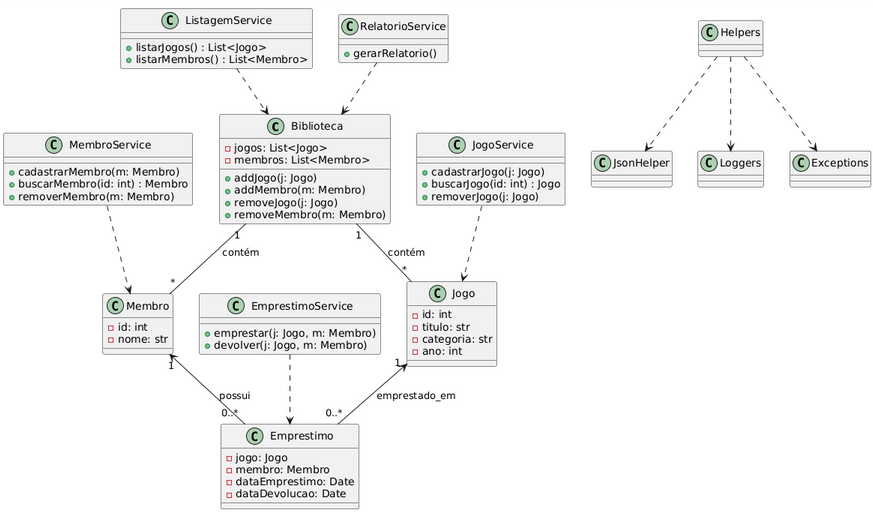
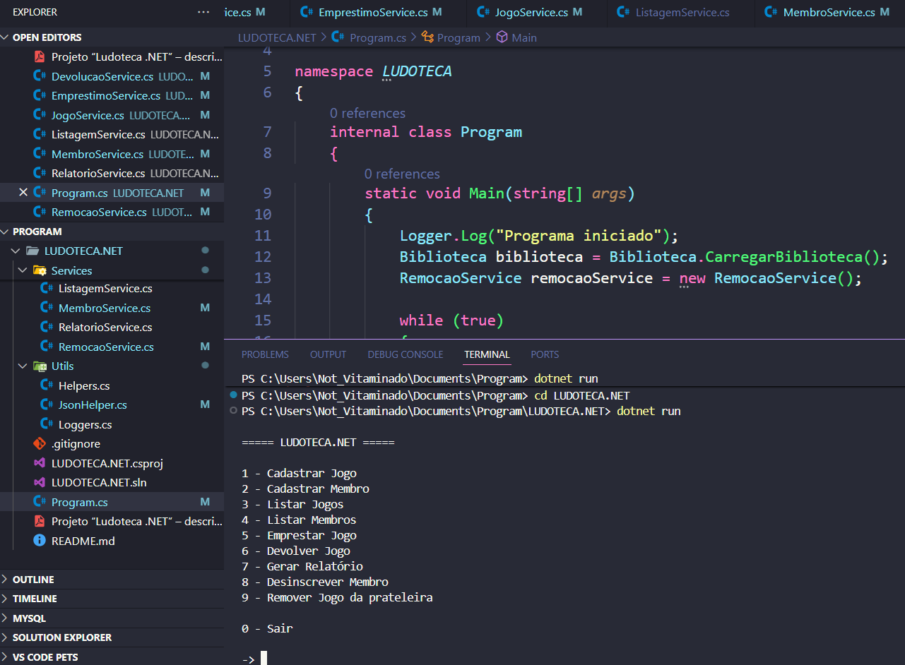
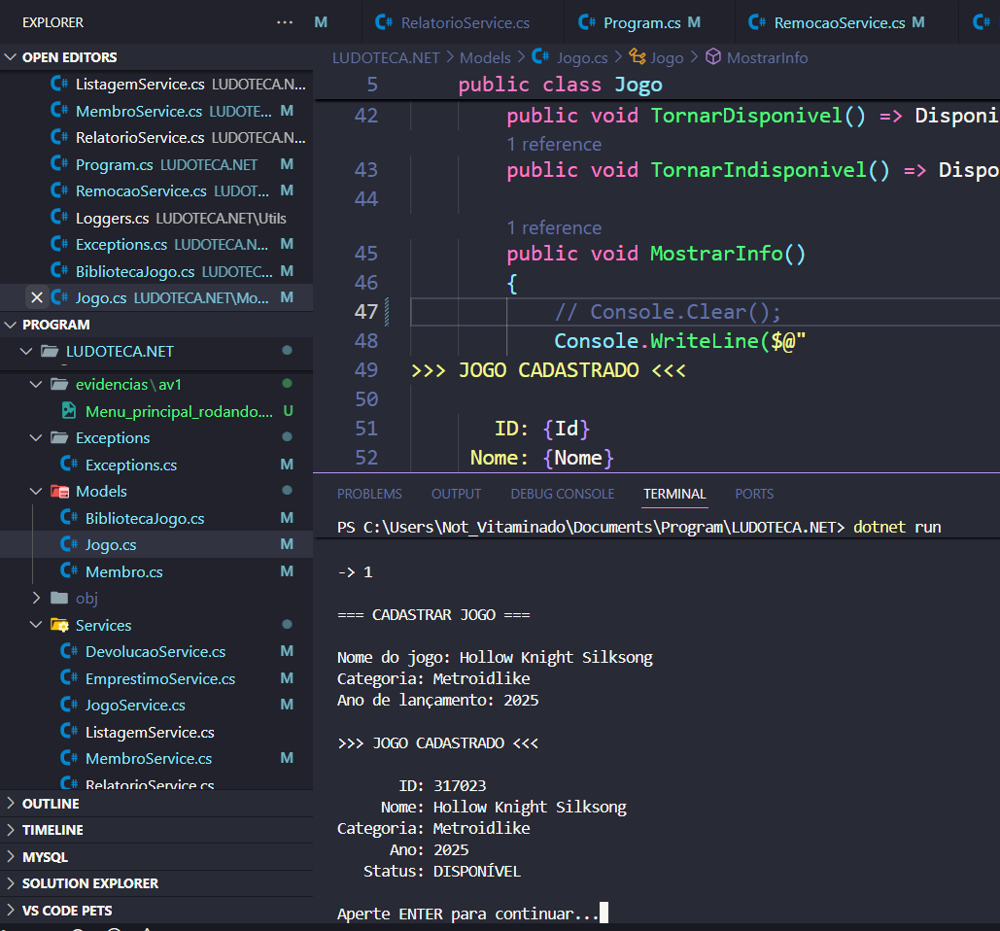
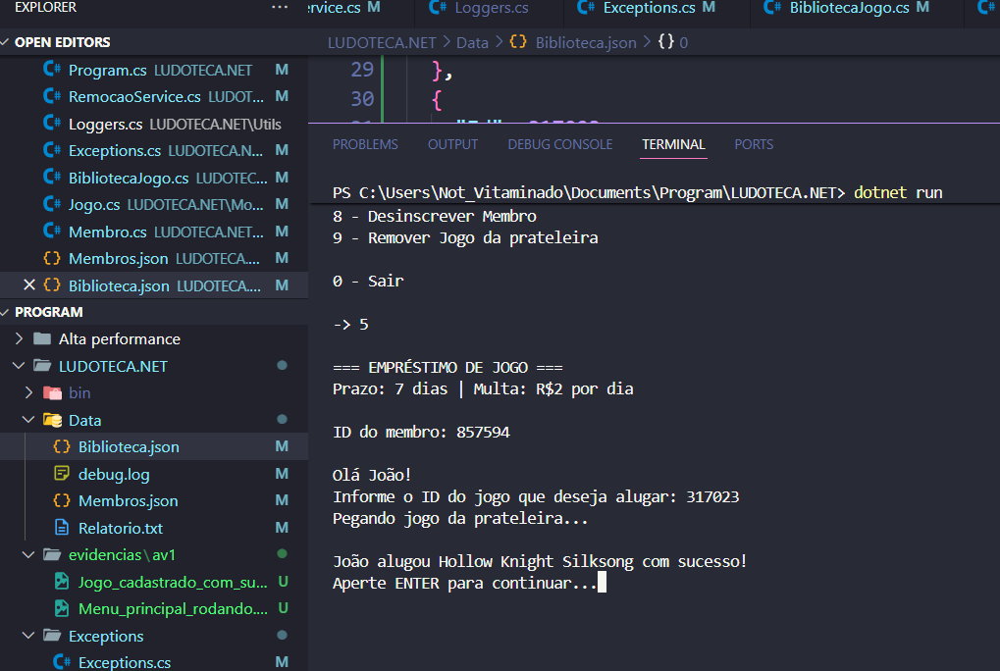
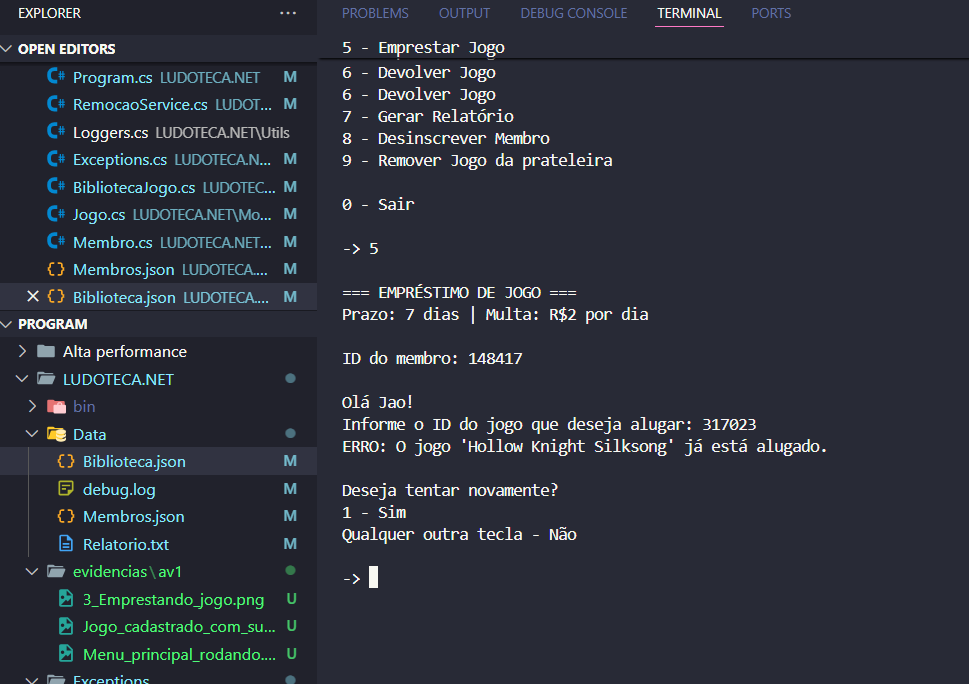
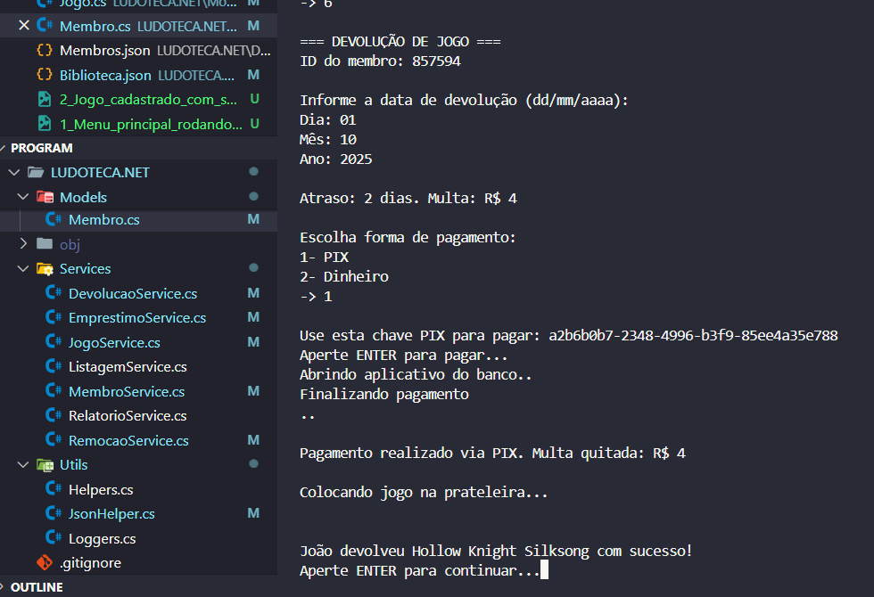

# LUDOTECA.NET

LUDOTECA.NET é um sistema em **C#** para gerenciar jogos, permitindo cadastrar membros, cadastrar jogos, emprestar e devolver jogos, excluir membro e jogo, com persistência em arquivos JSON.

---

## Membros
1. 06009925: João Victor Andrade Lima
2. 06010109: Carlos Leonardo Carvalho Otoline
3. 06008892: Arthur Fita Santana
4. 06005334: Giulia Muniz da Costa Massafra 
5. 06009870: Gabriel de Jesus Lopes Azevedo
---

### Pré-requisitos

- **.NET SDK 7.0 ou superior** ([Download](https://dotnet.microsoft.com/download/dotnet))  
- Git (opcional, para clonar o repositório)

### Instalação e execução

```bash
# Clonar o repositório
git clone https://github.com/User-JaoAndrade/LUDOTECA.NET
cd LUDOTECA.NET

# Compilar
dotnet build

# Executar
dotnet run 
```

---

### Funcionalidades

- Cadastro de jogos e membros.
- Listagem de jogos com status de disponibilidade.
- Empréstimo e devolução de jogos.
- Excluir Membro e Jogo.
- Cálculo automático de multa por atraso (R$2/dia).
- Persistência de dados em JSON (`Biblioteca.json` e `Membros.json`).

---

### Classes
- Biblioteca()
    - Jogos -> Linha 7
    - Membros -> Linha 8

- Jogo()
    - Id -> Linha 9
    - Nome -> Linha 10
    - Categoria -> Linha 11
    - AnoLancamento -> Linha 12
    - Disponivel -> Linha 13

- Membro()
    - Id -> Linha 9
    - Nome -> Linha 10
    - JogoAlugado -> Linha 11
    - DataAluguel -> Linha 12
    - DataDevolucao -> Linha 13

---

### Unified Modeling Language (Linguagem de Modelagem Unificada)



---

### Evidencias

Menu principal



Jogo Cadastrado



Emprestando jogo



Tentando alugar um jogo indisponivel



Devolução com multa


---
[VIDEO EXPLICATIVO](https://vimeo.com/1122340752?share=copy)